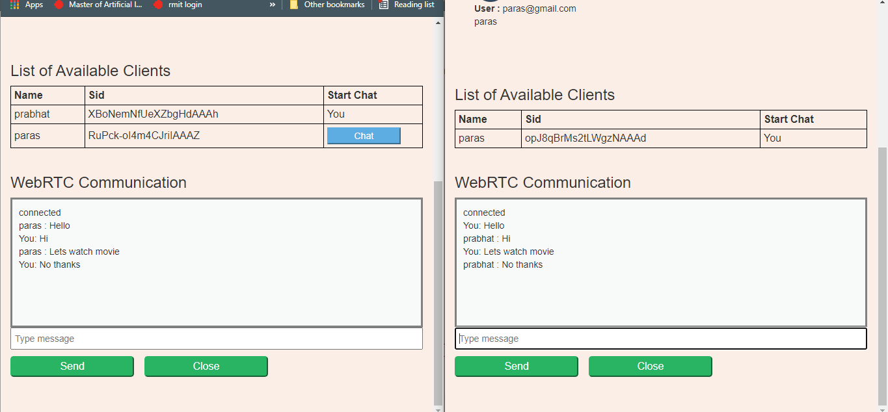

# WebRTC in `Flask` and `Javascript`

Creating a chat application which uses `WebRTC` connection for peer to peer communication. `Flask SocketIO` in only needed in initial stage for identifying the
clients, after that the peers or clients will communicate by themself.

<br />

---

<br />

## Developers Guideline
Type the following command based on your system to create the virtual enviornment in python.

```bash

#installing virutal environment

#for ubantu
python3 -m pip install --user virtualenv
#for windows
py -m pip install --user virtualenv

#creating instance of virtualenv
virtualenv venv

#activate virtualenv ubantu
source venv/bin/activate

#activate virtualenv ubantu
venv\Scripts\activate

#add the requirements
pip install -r requirements.txt

#running the on localhost 
python server.py

# running on gcloud 
# 1. create a new project on Google Cloud and copy its PROJECT ID
# 2. make sure you have app.yaml and requirements.txt
# 3. add your GOOGLE_APPLICATION_CREDENTIALS path to datastoreUitl.py , see reference[4]

gcloud app create --project = [YOUR_PROJECT_ID]

# it will ask for a region for deployment
gcloud app deploy
```
## Note:

Add your GOOGLE_APPLICATION_CREDENTIALS path to datastoreUitl.py , see reference[4] to access Google Data Store

<br />

---

<br />

## References

1. [Flask-SocketIO Getting Started](https://flask-socketio.readthedocs.io/en/latest/getting_started.html)
2. [RTCPeerConnection.createDataChannel()](https://developer.mozilla.org/en-US/docs/Web/API/RTCPeerConnection/createDataChannel) 
3.	[A simple RTCDataChannel sample](https://developer.mozilla.org/en-US/docs/Web/API/WebRTC_API/Simple_RTCDataChannel_sample)
4. [Getting started with authentication](https://cloud.google.com/docs/authentication/getting-started)
5. [flask-socketio Documentation](https://flask-socketio.readthedocs.io/_/downloads/en/latest/pdf/)

<br />

---

<br />

## Results


Displaying the chatting feature for `both` client

<br />



<br />

Displaying the video calling feature for `both` client

<br /><br />


<br />

Note: The code works better and faster with localhost.

<br />

---

<br />

## Thank you
